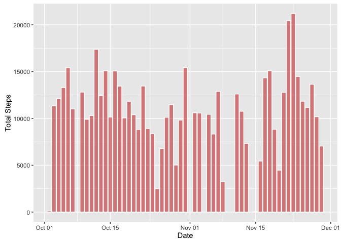

# Reproducible Research: Peer Assessment 1
Roberto Moctezuma  
11/13/2016  


## Loading and preprocessing the data

```r
activity <- read.csv("activity.csv", stringsAsFactors = FALSE)
activity$date <- as.Date(activity$date)
```

## What is mean total number of steps taken per day?
For this part of the assignment, you can ignore the missing values in the dataset.
Calculate the total number of steps taken per day


```r
activityNoNa <- activity[!is.na(activity$steps),]
tot_steps_day <- aggregate(activityNoNa$steps, by = list(activityNoNa$date), FUN = sum)
names(tot_steps_day) <- c('date', 'total_steps')
```

If you do not understand the difference between a histogram and a barplot, research the difference between them. Make a histogram of the total number of steps taken each day

```r
library(ggplot2)
ggplot(data = tot_steps_day, aes(date, total_steps)) + stat_summary(fun.y = sum, geom = 'bar', col = "white", fill = "#CC000080") + labs(x = "Date", y = "Total Steps")
```

<!-- -->

Calculate and report the mean and median of the total number of steps taken per day

```r
mean_steps <- mean(tot_steps_day$total_steps)
median_steps <- median(tot_steps_day$total_steps)
```
The mean of the total number of steps taken per day is 10766 and the median is 10765.

## What is the average daily activity pattern?
Make a time series plot of the 5-minute interval (x-axis) and the average number of steps taken, averaged across all days (y-axis).

The daily activity pattern shows increased activity during the day and reduced activity during the night, as per the following chart:


```r
ggplot(data = activityNoNa, aes(interval, steps)) + stat_summary(fun.y = mean, geom = 'line', col = "black") + labs(x = "Interval", y = "Total Steps") + geom_smooth(col = "steelblue")
```

<!-- -->

Which 5-minute interval, on average across all the days in the dataset, contains the maximum number of steps?

```r
daily_pattern <- aggregate(activityNoNa$steps, by = list(activityNoNa$interval), FUN = mean)
names(daily_pattern) <- c('interval','total_steps')
max_interval <- daily_pattern[which.max(daily_pattern$total_steps),]
```

The 5-minute interval with the maximum number of steps, on average, is 835 with 206.17 steps.

## Imputing missing values

Calculate and report the total number of missing values in the dataset (i.e. the total number of rows with 𝙽𝙰s)


```r
num_na <- sum(is.na(activity$steps))
```

There are 2304 missing values (NA) in the dataset.

Devise a strategy for filling in all of the missing values in the dataset. The strategy does not need to be sophisticated. For example, you could use the mean/median for that day, or the mean for that 5-minute interval, etc.
Create a new dataset that is equal to the original dataset but with the missing data filled in.

Let's impute data using the mean for that interval:

```r
new_activity <- activity
daily_pattern$interval <- as.factor(daily_pattern$interval)
new_activity_intervals <- as.factor(new_activity$interval)
activity_interval_mean <- daily_pattern[new_activity_intervals,2]
new_activity$steps[which(is.na(new_activity$steps))] <- activity_interval_mean[which(is.na(new_activity$steps))]
```

Make a histogram of the total number of steps taken each day and Calculate and report the mean and median total number of steps taken per day. Do these values differ from the estimates from the first part of the assignment? What is the impact of imputing missing data on the estimates of the total daily number of steps?


```r
new_tot_steps_day <- aggregate(new_activity$steps, by = list(new_activity$date), FUN = sum)
names(new_tot_steps_day) <- c('date', 'total_steps')
ggplot() + geom_line(data = tot_steps_day, aes(date, total_steps, color = "Original")) + geom_line(data = new_tot_steps_day, aes(date, total_steps, color = "Imputed")) + xlab('Interval') + ylab('Total Steps')
```

<!-- -->

As we can see, imputing values creates only a very slight difference in the new dataset.


```r
new_mean_steps <- mean(new_tot_steps_day$total_steps)
new_median_steps <- median(new_tot_steps_day$total_steps)
```

The mean of the total number of steps taken per day (assuming imputed data) is 10766 and the median is 10765 - exactly the same as the original data.

## Are there differences in activity patterns between weekdays and weekends?

For this part the 𝚠𝚎𝚎𝚔𝚍𝚊𝚢𝚜() function may be of some help here. Use the dataset with the filled-in missing values for this part.

Create a new factor variable in the dataset with two levels – “weekday” and “weekend” indicating whether a given date is a weekday or weekend day.

```r
new_activity$weekend <- as.factor(ifelse(weekdays(new_activity$date) %in% c('Saturday','Sunday'), 'weekend', 'weekday'))
```

Make a panel plot containing a time series plot (i.e. 𝚝𝚢𝚙𝚎 = "𝚕") of the 5-minute interval (x-axis) and the average number of steps taken, averaged across all weekday days or weekend days (y-axis). See the README file in the GitHub repository to see an example of what this plot should look like using simulated data.


```r
ggplot(data = new_activity, aes(x=interval, y=steps)) + stat_summary(fun.y = mean, geom = 'line', col = 'black') + facet_grid(weekend ~.)
```

<!-- -->


